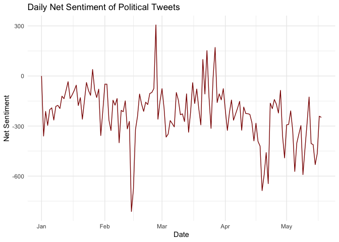

Sentiment Analysis of Indian Political Tweets: 2019 General Elections
================
Piyush Zaware

- [0.1 INTRODUCTION](#01-introduction)
- [0.2 DATA DESCRIPTION](#02-data-description)
- [0.3 DATA CLEANING AND
  PREPROCESSING](#03-data-cleaning-and-preprocessing)
- [0.4 WORD FREQUENCY ANALYSIS](#04-word-frequency-analysis)
- [0.5 SENTIMENT TRAJECTORY](#05-sentiment-trajectory)
- [0.6 SENTIMENT WORD CLOUD](#06-sentiment-word-cloud)
- [0.7 PARTYWISE CLASSIFICATION](#07-partywise-classification)
- [0.8 SENTIMENT BY PARTY](#08-sentiment-by-party)
- [0.9 EMOTIONAL BREAKDOWN](#09-emotional-breakdown)
- [0.10 TOP WORDS BY EACH PARTY](#010-top-words-by-each-party)
- [0.11 CONCLUSION](#011-conclusion)

## 0.1 INTRODUCTION

During the 2019 Indian General Elections, I noticed how significantly
Twitter transformed into a political battleground. Political parties and
their supporters increasingly turned to the platform to influence
discourse, shape narratives, and connect with voters. In this project, I
analyze a large collection of tweets posted between January and May
2019, with the aim of understanding how sentiment and emotional tone
varied across different political parties. Using tidy text analysis, I
focus on word frequencies, sentiment patterns, and emotional vocabulary
to explore the linguistic footprint of Indian political campaigning on
social media.

## 0.2 DATA DESCRIPTION

The dataset I used consists of tweets collected during the election
campaign window—from January 1 to May 23, 2019. These tweets were
extracted based on keywords, hashtags, and usernames linked to political
parties and leaders. Each entry includes the tweet content, timestamp,
and the Twitter handle of the user who posted it. To narrow the scope, I
filtered the dataset to focus only on tweets from the official campaign
period and removed tweets that were empty or improperly formatted.

``` r
tweets <- read_csv("IndianElection19TwitterData.csv")
tweets <- tweets %>%
  rename(text = Tweet, timestamp = Date, user = User) %>%
  mutate(timestamp = as.POSIXct(timestamp, format = "%Y-%m-%d %H:%M:%S"),
         date = as.Date(timestamp)) %>%
  filter(date >= as.Date("2019-01-01") & date <= as.Date("2019-05-23")) %>%
  drop_na(text)
```

``` r
# Unnest words and remove stopwords
data("stop_words")

tweet_words <- tweets %>%
  select(user, date, text) %>%
  unnest_tokens(word, text) %>%
  filter(!word %in% stop_words$word, 
         str_detect(word, "^[a-z']+$"))
```

## 0.3 DATA CLEANING AND PREPROCESSING

Before diving into the analysis, I cleaned the data to prepare it for
text mining. I tokenized the tweets into individual words, converted
them to lowercase, removed punctuation, and eliminated common stop words
such as “the” or “and.” This preprocessing step allowed me to focus on
politically meaningful words that reveal discourse patterns, rather than
on grammatical fillers.

## 0.4 WORD FREQUENCY ANALYSIS

To begin, I identified the most common words across all tweets. As
expected, names like “modi,” “rahul,” “bjp,” “vote,” and “congress”
topped the list. These high-frequency words confirm the dataset’s strong
political focus and show how central party figures were to the online
discussion. It also reflects the dominance of national issues and
personalities in voters’ minds during the campaign.

To go beyond basic word frequency, I calculated TF-IDF scores to find
unique words used by individual users. This technique helps spotlight
the most distinctive words for each handle—whether political parties,
media houses, or individuals. For instance, some users used words like
“chowkidar,” “priyanka,” or “surgicalstrike” far more often than others,
suggesting targeted narratives and ideological leanings. It also gave me
a sense of who was pushing which messages more aggressively.

``` r
top_words <- tweet_words %>%
  count(word, sort = TRUE) %>%
  top_n(15)

ggplot(top_words, aes(x = reorder(word, n), y = n)) +
  geom_col(fill = "steelblue") +
  coord_flip() +
  labs(title = "Most Common Words in Political Tweets (2019)",
       x = NULL, y = "Frequency") +
  theme_minimal()
```

<!-- -->

``` r
user_tf_idf <- tweet_words %>%
  count(user, word) %>%
  bind_tf_idf(word, user, n) %>%
  arrange(desc(tf_idf))

top_tf_idf <- user_tf_idf %>%
  group_by(user) %>%
  slice_max(tf_idf, n = 1) %>%
  ungroup()

head(top_tf_idf, 10)
```

    ## # A tibble: 10 × 6
    ##    user            word                   n     tf   idf tf_idf
    ##    <chr>           <chr>              <int>  <dbl> <dbl>  <dbl>
    ##  1 0007_CJ         cows                   3 0.111   7.07  0.786
    ##  2 001_chandan     chandnichowk           1 0.05    8.50  0.425
    ##  3 001amitsingh    sudhanshubjp           2 0.1    10.8   1.08 
    ##  4 001ankitG       abhinandan             1 0.5     4.71  2.36 
    ##  5 002_akash       answerable             1 0.0909  7.41  0.673
    ##  6 004Pruth        pass                   2 0.1     5.48  0.548
    ##  7 0062a04e1ceb458 scale                  1 0.143   6.24  0.892
    ##  8 007Bhas         aamaadmi               1 0.0455  8.73  0.397
    ##  9 007Fahadkhan    electioncommission     1 0.333   3.45  1.15 
    ## 10 007__AK         opposit                1 0.0714 10.8   0.772

## 0.5 SENTIMENT TRAJECTORY

Using the Bing sentiment lexicon, I calculated daily sentiment scores—by
subtracting the number of negative words from positive ones. When I
plotted these over time, I noticed spikes in both directions around
mid-April and early May, which align with key phases of the election
campaign. While there were brief sentiment surges, the overall tone
remained relatively balanced across the period. This suggested to me
that praise and criticism were flowing in almost equal measure during
the campaign, possibly driven by debates, manifesto releases, and
campaign rallies.

``` r
# Use Bing sentiment lexicon
sentiment_words <- tweet_words %>%
  inner_join(get_sentiments("bing"))

sentiment_by_day <- sentiment_words %>%
  count(date, sentiment) %>%
  pivot_wider(names_from = sentiment, values_from = n, values_fill = 0) %>%
  mutate(net_sentiment = positive - negative)

ggplot(sentiment_by_day, aes(x = date, y = net_sentiment)) +
  geom_line(color = "darkred") +
  labs(title = "Daily Net Sentiment of Political Tweets",
       x = "Date", y = "Net Sentiment") +
  theme_minimal()
```

<!-- -->

## 0.6 SENTIMENT WORD CLOUD

To visualize sentiment-rich words, I generated a word cloud using terms
matched to either positive or negative sentiment. Words like
“development,” “trust,” and “victory” stood out on the positive side,
while “lies,” “corrupt,” and “scam” featured among the negative. This
mix of aspirational and accusatory language felt typical of high-stakes
electoral contests, especially in India’s charged political climate.

``` r
wordcloud_data <- sentiment_words %>%
  count(word, sentiment, sort = TRUE)

wordcloud(words = wordcloud_data$word, 
          freq = wordcloud_data$n, 
          min.freq = 30,
          max.words = 100,
          colors = c("firebrick", "forestgreen"),
          random.order = FALSE)
```

<!-- -->

``` r
nrc <- get_sentiments("nrc")
```

``` r
bing <- get_sentiments("bing")
```

## 0.7 PARTYWISE CLASSIFICATION

To better compare patterns, I assigned tweets to major political parties
based on keyword mentions (like “Modi” for BJP or “Rahul Gandhi” for
INC). This classification enabled me to break down sentiment and
emotional tones by party. I filtered out tweets without clear party
references to maintain clarity in comparison.

``` r
# Party keywords
party_patterns <- list(
  BJP   = c("@BJP4India", "\\bBJP\\b", "Modi", "Narendra Modi"),
  INC   = c("@INCIndia", "\\bCongress\\b", "Rahul Gandhi", "@RahulGandhi"),
  AAP   = c("@AamAadmiParty", "\\bAAP\\b", "Arvind Kejriwal"),
  TMC   = c("@AITCofficial", "\\bTMC\\b", "Mamata Banerjee"),
  CPIM  = c("@cpimspeak", "@cpofindia", "\\bCPI\\b", "\\bCPIM\\b"),
  SP    = c("@samajwadiparty", "Akhilesh Yadav", "\\bSP\\b")
)

# Assign party mentions
detect_party <- function(tweet) {
  for (party in names(party_patterns)) {
    if (any(str_detect(tweet, regex(party_patterns[[party]], ignore_case = TRUE)))) {
      return(party)
    }
  }
  return("Other")
}

tweets <- tweets %>%
  mutate(party = map_chr(text, detect_party)) %>%
  filter(party != "Other")  # Optional: focus only on clear party mentions

# Tokenize and clean
tidy_tweets <- tweets %>%
  unnest_tokens(word, text) %>%
  anti_join(stop_words, by = "word") %>%
  filter(str_detect(word, "^[a-z]+$"))  # remove numbers/symbols
```

## 0.8 SENTIMENT BY PARTY

The party-wise sentiment analysis showed interesting contrasts. Tweets
about the BJP contained slightly more positive sentiment compared to
others—possibly reflecting successful outreach or high engagement from
supporters. On the other hand, tweets about the Congress and AAP parties
had a more critical tone, with higher levels of negative sentiment. I
interpreted this as evidence of an opposition-driven strategy that
emphasized critique rather than celebration.

``` r
# Sentiment analysis using Bing
sentiment_bing <- tidy_tweets %>%
  inner_join(bing, by = "word") %>%
  count(party, sentiment, sort = TRUE)

ggplot(sentiment_bing, aes(x = reorder(party, -n), y = n, fill = sentiment)) +
  geom_col(position = "dodge") +
  labs(title = "Sentiment Word Usage by Party",
       x = "Party", y = "Word Count", fill = "Sentiment") +
  theme_minimal()
```

<!-- -->

## 0.9 EMOTIONAL BREAKDOWN

Using the NRC lexicon, I categorized emotion-related words (e.g., joy,
anger, fear, trust). BJP-related tweets leaned more heavily into
emotions like “joy” and “trust,” while INC and TMC were more frequently
associated with “anger” and “fear.” This variation may reflect differing
campaign tactics—BJP projecting confidence and momentum, while the
opposition appealed to dissatisfaction and a sense of crisis.

``` r
# Emotion breakdown using NRC
emotion_df <- tidy_tweets %>%
  inner_join(nrc, by = "word") %>%
  count(party, sentiment) %>%
  filter(sentiment %in% c("joy", "anger", "fear", "trust", "sadness", "disgust"))

ggplot(emotion_df, aes(x = reorder(party, -n), y = n, fill = sentiment)) +
  geom_col(position = "stack") +
  labs(title = "Emotion Distribution Across Parties (NRC Lexicon)",
       x = "Party", y = "Word Count", fill = "Emotion") +
  theme_minimal()
```

<!-- -->

## 0.10 TOP WORDS BY EACH PARTY

By comparing the top 10 words used in tweets about each party, I could
see how their messaging differed. BJP tweets often referenced “nation,”
“development,” and “leadership.” Congress-related tweets focused more on
terms like “farmer,” “NYAY,” and “jobs,” which echoed their welfare
agenda. AAP’s vocabulary highlighted governance priorities, with words
like “education” and “health.” These differences felt consistent with
how the parties positioned themselves to voters—nationalism and growth
vs. welfare and governance.

``` r
# Top words per party
top_words <- tidy_tweets %>%
  count(party, word, sort = TRUE) %>%
  group_by(party) %>%
  slice_max(order_by = n, n = 10)

ggplot(top_words, aes(x = reorder_within(word, n, party), y = n, fill = party)) +
  geom_col(show.legend = FALSE) +
  facet_wrap(~party, scales = "free_y") +
  scale_x_reordered() +
  coord_flip() +
  labs(title = "Top 10 Words Used per Party", x = NULL, y = "Frequency") +
  theme_minimal()
```

<!-- -->

## 0.11 CONCLUSION

Through this text analysis, I gained valuable insights into how
different political parties shaped public discourse during the 2019
Indian General Elections. Although all parties used both positive and
negative rhetoric, the tone, vocabulary, and emotional triggers varied.
BJP appeared to lead in projecting positive sentiment and trust, while
Congress and AAP emphasized critique and policy issues. These patterns
reflect both top-down campaign messaging and bottom-up voter engagement.
If I had more time, I would compare this dataset to offline speech
transcripts or newspaper headlines to test whether the online discourse
matched real-world narratives.
